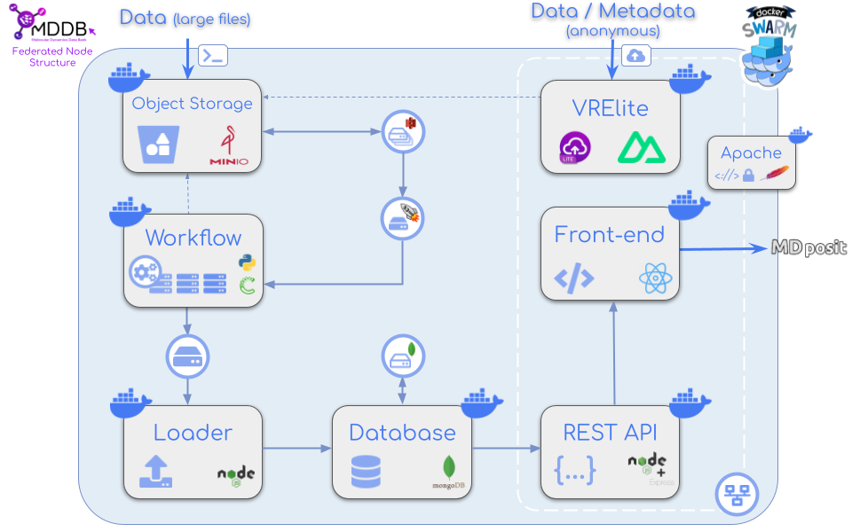
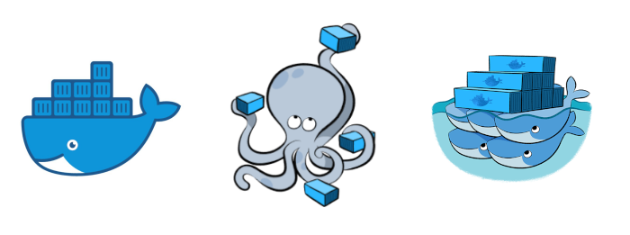

# MDposit - MDDB container services

In this repository there are all the files needed for executing the different **MDposit - MDDB services**: **apache**, **front-end**, **back-end**, **workflow**, **database**, **data loader**, **Object storage** and **VRE lite**. All these services have been integrated into **containers** and connected between them via docker/podman **network**. 

<div align="center" style="display:flex;align-items:center;justify-content:space-around;padding:20px 0;">
<a href="https://mdposit.mddbr.eu/"></a><a href="https://mddbr.eu"></a>
</div>

Schema of **MDposit - MDDB container** web services. Each box in the schema is a **service** encapsulated into a **docker/podman container**. The **services** cover the entire process from the **raw data** to the **website analyses**. See the following figure:

<div align="center" style="display:flex;align-items:center;justify-content:space-around;">

</div>

## Services description

### Apache

The Apache HTTP Server, colloquially called Apache, is a **Web server** application notable for playing a key role in the initial growth of the World Wide Web:

https://hub.docker.com/_/httpd

### REST API

The **REST API** is a **NodeJS + Express** application.

For this project, the following repo has been used:

https://mmb.irbbarcelona.org/gitlab/aluciani/MoDEL-CNS_REST_API

### Website client

The **website client** is a **React App**.

For this project, the following repo has been used:

https://mmb.irbbarcelona.org/gitlab/gbayarri/mdposit-client-build

### Data loader

The **data loader** is a  **node JS script** made for load, list and remove data from a mongodb database.

For this project, the following repo has been used:

https://mmb.irbbarcelona.org/gitlab/aluciani/MoDEL-CNS_DB_loader

### Workflow

The aim for this tool is to **process raw MD data** and obtain standard **structure** and **trajectory** files.

For this project, the following repo has been used:

https://mmb.irbbarcelona.org/gitlab/d.beltran.anadon/MoDEL-workflow

### VRE lite

The **VRE lite** is a **Nuxt** application.

For this project, the following repo has been used:

https://mmb.irbbarcelona.org/gitlab/gbayarri/mddb-vre

### Database

The database used is **mongodb** inside a docker container:

https://github.com/docker-library/mongo

For this project, the chosen version of **mongo** is **6**.

### Object Storage

In order to provide the users a way to **transfer big files** that can't be uploaded via web, a docker **MinIO** server is integrated into the infrastructure.

https://hub.docker.com/r/minio/minio

### Cronjobs

For the sake of performing **automatic operations** such as cleaning or checking, there is a **cron jobs service**.

## Before the installation

There are a **few checks** to do in the **VM** where the services will be installed:

### Check ports

Check that the **external access** for the **443** and **9000** ports is opened:

```sh
nc -zv vm_ip 443
nc -zv vm_ip 9000
```

If some of the ports has not opened the external access, contact the **VM admin**.

Note that **9000** is the **MinIO** port by default, but in some implementations **this port may vary**, it will depend on the specifications of each node.

### Check date 

For the sake of connecting **safely** to the **MinIO API** via **AWS Signature Version 4**, the date of the VM must be properly configured. If it's not correct, try:

```sh
ntpdate pool.ntp.org
```

Or, in some configurations:

```sh
ntpdate gateway_ip
```

If none of the above works, contact the **VM admin**.

### Transfer the SSL/TSL certificates

If the **SSL/TSL** certificates are available, copy them into the **same VM** where the script is being executed. Then, when running the [**deployment script**](#via-script), the user will be prompted to copy them to the storage system.

## Installation via Docker

<div align="center" style="display:flex;align-items:center;justify-content:space-around;">

</div>

### Clone repository

First off, please **clone this repository** into the VM where the services will be deployed:

```sh
git clone https://mmb.irbbarcelona.org/gitlab/gbayarri/mddb-docker.git
```

Then, enter the new folder:

```sh
cd mddb-docker
```

Once the repository has been cloned, there are two ways to deploy it: [**via script**](#via-script) and [**manually, step by step**](#manually-step-by-step).

### Via script

A **deploy script** is provided for executing the **different steps** of the deploying process in an almost **automatic** way. Please execute the script, located in [**scripts/docker-deploy.py**](./scripts/docker-deploy.py). This script allows two operations:

* [**Install docker and docker-compose**](#install-docker-and-docker-compose)
* [**Deploy Docker Swarm stack**](#deploy-docker-swarm-stack)

How to execute the help script from the root of this repository:

```sh
python3 scripts/docker-deploy.py -h
```

#### Install docker and docker-compose

```sh
python3 scripts/docker-deploy.py -d
```

Be aware that you will need **sudo user** for executing the installation of **docker** and **docker-compose**.

At the end of the execution of the script, you will be asked for the **main path of the storage system**. Inside this path a **docker/** folder will be generated. All the **Docker images and data** will be stored inside this volume.

#### Deploy Docker Swarm stack

Execute script for deploying Docker Swarm Stack:

```sh
python3 scripts/docker-deploy.py -s
```

Or, for a new clean installation (it will **leave the swarm**, **remove it** and **remove all docker cache** before deploying the stack):

```sh
python3 scripts/docker-deploy.py -s -r
```

Be aware that you may need **sudo user** for creating the storage folders.

Besides, a `.env` file will be created taking [**.env.docker.git**](./.env.docker.git) as a template. For more information about all the **environment** variables that are set in this file, please visit the [**configuration section**](./readme/config.md#env-file). Take into account that only the main evironment variables will be created interactively. In some cases this `.env` file must be modified manually.

When executing the **deploy script**, the user will be prompted to answer some questions for filling some of the **variables** in the `.env` file:

* **Main path for the storage system:** At the beginning of the execution of the script, you will be asked for the **main path of the storage system**. Inside this path the following **folder structure** will be generated:

  * [**certs/**](readme/storage.md#certificates) (apache **SSL/TSL** certificates)
  * [**data/**](readme/storage.md#workflow) (**workflow** output data and **loader** input data)
  * [**docker/**](readme/storage.md#docker) (**docker images**, generated in the [**step before**](#install-docker-and-docker-compose))
  * [**db/**](readme/storage.md#mongodb) (**MongoDB** data)
  * [**logs/**](readme/storage.md#logs) (**VRE lite** and cronjobs logs)
  * [**minio/**](readme/storage.md#minio) (**MinIO** data)
    * disk1/ (**MinIO** data distributed in multi-drive configuration)
    * disk2/ (**MinIO** data distributed in multi-drive configuration)
    * disk3/ (**MinIO** data distributed in multi-drive configuration)
    * disk4/ (**MinIO** data distributed in multi-drive configuration)

* **SSL/TSL certificates:** If the **SSL/TSL** certificates are available, they can be copied into the **certs/** folder during the execution of the **script**. Be sure to have them located in the **same VM** where the script is being executed.
* **Node:** Node identifier, mandatory. 
* **Stack name:** Docker Swarm stack name. Default value: **my_stack**.
* **Database name:** MongoDB database name. Default value: **mddb_db**.
* **Root database user:** MongoDB root database user. Default value: **root**.
* **Root database password:** MongoDB root database password. Default value: **root**.
* **R/W database user:** Read / Write database user for the loader service. Default value: **user_rw**.
* **R/W database password:** Read / Write database password for the loader service. Default value: **pwd_rw**.
* **R database user:** Read database user for the REST API service. Default value: **user_r**.
* **R database password:** Read database password for the REST API service. Default value: **pwd_r**.
* **MinIO root user:** MinIO root user. Default value: **admin**.
* **MinIO root password:** MinIO root password. Default value: **secretpassword**.
* **API MinIO port:** Port for the MinIO API. Default value: **9000**.

Once the deploy has finished, the services should be up and running and the one-off tasks ready to execute. For checking and/or executing all the services, [**please click here**](readme/docker-swarm.md#execute-services).

⚠️ **Although all the steps of the installation and deployment are automatic, it's highly recommended to read all the documentation before running this script** ⚠️ 

The different sections of the documentation are:

* [**Set Up Storage**](readme/storage.md)
* [**Set Up Virtual Machine**](readme/setup.md)
* [**Set Up Configuration Files**](readme/config.md)
* [**Deploy Docker Swarm**](readme/docker-swarm.md)

### Manually step by step

Please execute the following steps for installing the **MDposit - MDDB container services** manually:

#### Set Up Storage

The **Object Storage** and **Mongo** services will need a **disk path** to save all the **data** generated. The **Workflow** and the **Loader** services will need **another disk path** as well for **saving** (in the case of the workflow) and **retrieving** (in the case of the loader) the data that will be **uploaded** to the **website** in the last instance.

[**Click here for seeing the detailed instructions for setting up the Storage**](readme/storage.md)

#### Set Up Virtual Machine

Let's take a **clear** and **empty Virtual Machine** as a starting point for installing the **MDposit - MDDB Docker services**. It's highly recommended to have installed in it **Ubuntu 18.04 or superior**, though the services should work in other **Linux** distributions.

[**Click here for seeing the detailed instructions for setting up a Virtual Machine**](readme/setup.md)

#### Set Up Configuration Files

First off, all the **environment files** must be created and updated as well as the **docker-compose.yml** and **mongo-init.js** files. 

[**Click here for seeing the detailed instructions for setting up the Configuration Files**](readme/config.md)

#### Deploy Docker Swarm

Once the Virtual Machine has all the **dependencies installed** and all the **config** files are **set up**, it's the moment of executing the **Docker Swarm** service. **Docker Swarm** is a **container orchestration** tool for **clustering** and **scheduling** Docker containers. 

[**Click here for seeing the detailed instructions for executing Docker Swarm**](readme/docker-swarm.md)

### Tips

A list of **useful tips** for **developing** and **debugging** has been defined for the sake of easing all the process.

[**Click here for seeing the Tips**](readme/tips.md)

## Installation via Podman

<div align="center" style="display:flex;align-items:center;justify-content:space-around;">

</div>

### Clone repository

First off, please **clone this repository** into the VM where the services will be deployed:

```sh
git clone https://mmb.irbbarcelona.org/gitlab/gbayarri/mddb-docker.git
```

Then, enter the new folder:

```sh
cd mddb-docker
```

Once the repository has been cloned, there are two ways to deploy it: [**via script**](#via-script-1) and [**manually, step by step**](#manually-step-by-step-1).

### Via script

A **deploy script** is provided for executing the **different steps** of the deploying process in an almost **automatic** way. Please execute the script, located in [**scripts/podman-deploy.py**](./scripts/podman-deploy.py). This script [**deploys all the services**](#deploy-podman-stack) with Podman.

How to execute the help script from the root of this repository:

```sh
python3 scripts/podman-deploy.py -h
```

#### Deploy Podman stack

Execute script for deploying Podman Stack:

```sh
python3 scripts/podman-deploy.py
```

Or, for a new clean installation (**remove all the containers** and **Podman cache** before deploying the stack):

```sh
python3 scripts/podman-deploy.py -r
```

Besides, a `.env` file will be created taking [**.env.podman.git**](./.env.podman.git) as a template. For more information about all the **environment** variables that are set in this file, please visit the [**configuration section**](./readme/config.md#env-file). Take into account that only the main evironment variables will be created interactively. In some cases this `.env` file must be modified manually.

When executing the **deploy script**, the user will be prompted to answer some questions for filling some of the **variables** in the `.env` file:

* **Main path for the storage system:** At the beginning of the execution of the script, you will be asked for the **main path of the storage system**. Inside this path the following **folder structure** will be generated:

  * [**certs/**](readme/storage.md#certificates) (apache **SSL/TSL** certificates)
  * [**data/**](readme/storage.md#workflow) (**workflow** output data and **loader** input data)
  * [**db/**](readme/storage.md#mongodb) (**MongoDB** data)
  * [**logs/**](readme/storage.md#logs) (**VRE lite** and cronjobs logs)
  * [**minio/**](readme/storage.md#minio) (**MinIO** data)
    * disk1/ (**MinIO** data distributed in multi-drive configuration)
    * disk2/ (**MinIO** data distributed in multi-drive configuration)
    * disk3/ (**MinIO** data distributed in multi-drive configuration)
    * disk4/ (**MinIO** data distributed in multi-drive configuration)

* **SSL/TSL certificates:** If the **SSL/TSL** certificates are available, they can be copied into the **certs/** folder during the execution of the **script**. Be sure to have them located in the **same VM** where the script is being executed.
* **Node:** Node identifier, mandatory. 
* **Database name:** MongoDB database name. Default value: **mddb_db**.
* **Root database user:** MongoDB root database user. Default value: **root**.
* **Root database password:** MongoDB root database password. Default value: **root**.
* **R/W database user:** Read / Write database user for the loader service. Default value: **user_rw**.
* **R/W database password:** Read / Write database password for the loader service. Default value: **pwd_rw**.
* **R database user:** Read database user for the REST API service. Default value: **user_r**.
* **R database password:** Read database password for the REST API service. Default value: **pwd_r**.
* **MinIO root user:** MinIO root user. Default value: **admin**.
* **MinIO root password:** MinIO root password. Default value: **secretpassword**.
* **API MinIO port:** Port for the MinIO API. Default value: **9000**.

Once the deploy has finished, the services should be up and running and the one-off tasks ready to execute. For checking and/or executing all the services, [**please click here**](readme/podman.md#execute-services).

⚠️ **Although all the steps of the installation and deployment are automatic, it's highly recommended to read all the documentation before running this script** ⚠️ 

The different sections of the documentation are:

* [**Set Up Storage**](readme/storage.md)
* [**Set Up Configuration Files**](readme/config.md)
* [**Deploy Podman**](readme/podman.md)

### Manually step by step

Please execute the following steps for installing the **MDposit - MDDB container services** manually:

#### Set Up Storage

The **Object Storage** and **Mongo** services will need a **disk path** to save all the **data** generated. The **Workflow** and the **Loader** services will need **another disk path** as well for **saving** (in the case of the workflow) and **retrieving** (in the case of the loader) the data that will be **uploaded** to the **website** in the last instance.

[**Click here for seeing the detailed instructions for setting up the Storage**](readme/storage.md)

#### Set Up Configuration Files

First off, all the **environment files** must be created and updated as well as the **docker-compose.yml** and **mongo-init.js** files. 

[**Click here for seeing the detailed instructions for setting up the Configuration Files**](readme/config.md)

#### Deploy Podman

Once the Virtual Machine has all the **dependencies installed** and all the **config** files are **set up**, it's the moment of **building** and **running** the **Podman containers**.

[**Click here for seeing the detailed instructions for building and running Podman**](readme/podman.md)

### Tips

A list of **useful tips** for **developing** and **debugging** has been defined for the sake of easing all the process.

[**Click here for seeing the Tips**](readme/tips-podman.md)

## Credits

Daniel Beltran, Genís Bayarri, Adam Hospital.

## Copyright & licensing

This website has been developed by the [MMB group](https://mmb.irbbarcelona.org) at the [IRB Barcelona](https://irbbarcelona.org).

© 2024 **Institute for Research in Biomedicine**

Licensed under the **Apache License 2.0**.