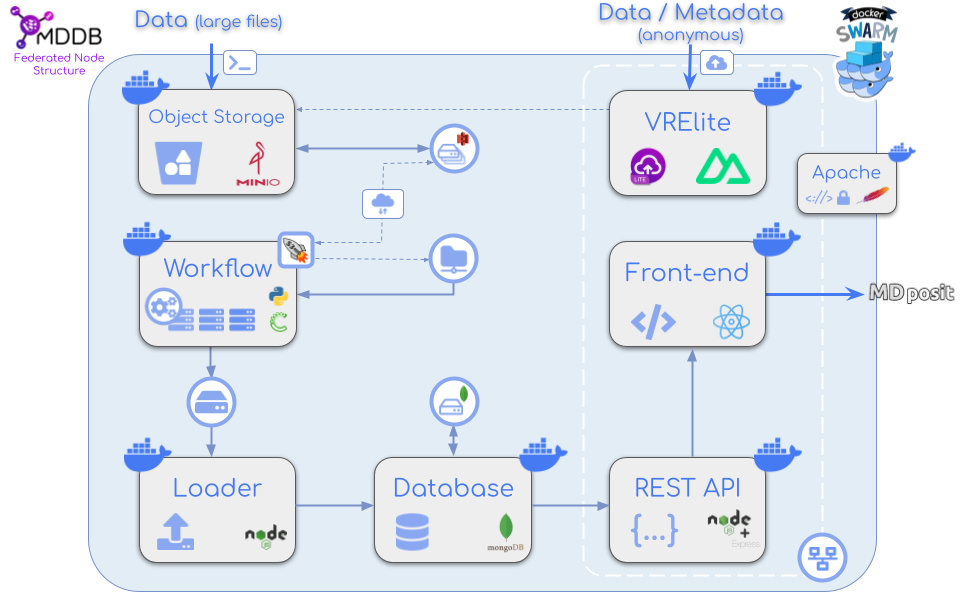

# MDposit - MDDB Docker services

In this repository there are all the files needed for executing the different **MDposit - MDDB services**: **front-end**, **back-end**, **workflow**, **database** and **data loader**. All these services have been integrated into **docker containers** and connected between them via docker **network**. 

<div align="center" style="display:flex;align-items:center;justify-content:space-around;padding:20px 0;">
<a href="https://mdposit.mddbr.eu/"></a><a href="https://mddbr.eu"></a>
</div>

Schema of **MDposit - MDDB Docker** web services. Each box in the schema is a **service** encapsulated into a **docker container**. The **services** cover the entire process from the **raw data** to the **website analyses**. See the following figure:

<div align="center" style="display:flex;align-items:center;justify-content:space-around;">

</div>

## Services description

### REST API

The **REST API** is a **NodeJS + Express** application.

For this project, the following repo has been used:

https://mmb.irbbarcelona.org/gitlab/aluciani/MoDEL-CNS_REST_API

### Website client

The **website client** is a **React App**.

For this project, the following repo has been used:

https://mmb.irbbarcelona.org/gitlab/d.beltran.anadon/mdposit_client

### Data loader

The **data loader** is a node **JS script** made for load, list and remove data from a mongodb database.

For this project, the following repo has been used:

https://mmb.irbbarcelona.org/gitlab/aluciani/MoDEL-CNS_DB_loader

### Workflow

The aim for this tool is to **process raw MD data** and obtain standard **structure** and **trajectory** files.

For this project, the following repo has been used:

https://mmb.irbbarcelona.org/gitlab/d.beltran.anadon/MoDEL-workflow

### Database

The database used is **mongodb** inside a docker container:

https://github.com/docker-library/mongo

For this project, the choosen version of **mongo** is **6**.

## Installation

Please execute the following steps for installing the **MDposit - MDDB Docker services**:

### Setting up Virtual Machine

Let's take a **clear** and **empty Virtual Machine** as a starting point for installing the **MDposit - MDDB Docker services**. It's highly recommended to have installed in it **Ubuntu 18.04 or superior**, though the services should work in other **Linux** distributions.

[**Click here for seeing the detailed instructions for setting up a Virtual Machine**](readme/setup.md)

### Execute Docker Compose

Once the Virtual Machine has all the **dependencies installed** it's the moment of executing the **Docker Compose** service. **Docker Compose** is a tool for defining and running **multi-container** applications. 

[**Click here for seeing the detailed instructions for executing Docker Compose**](readme/docker-compose.md)

### Tips

A list of **useful tips** for **developing** and **debugging** has been defined for the sake of easing all the process.

[**Click here for seeing the Tips**](readme/tips.md)


## Prepare configuration files

### docker-compose.yml

Copy docker-compose-git.yml into **docker-compose.yml** and modify the volumes' routes. 

Take a look as well at the **website ports**. They may change depending on the host configuration. Changing the port implies to change it as well in the [**website/Dockerfile**](website/Dockerfile). (TODO rest/client!!!)

```yaml
services:
  loader:
    image: loader_image   # name of loader image
    container_name: my_loader   # name of loader container
    platform: linux/amd64
    build:
      context: ./loader   # folder to search Dockerfile for this image
    depends_on:
      - mongodb
    working_dir: /data
    volumes:
      - /path/to/loader/files:/data   # path where the loader will look for files
    networks:
      - my_network

  workflow:
    image: workflow_image
    container_name: my_workflow
    platform: linux/amd64
    build:
      context: ./workflow   # folder to search Dockerfile for this image
    working_dir: /data
    volumes:
      - /path/to/workflow/files:/data

  rest:
    image: rest_image
    container_name: my_rest
    platform: linux/amd64
    build:
      context: ./rest   # folder to search Dockerfile for this image
    depends_on:
      - mongodb
    ports:
      - "8081:3000"   # port mapping, be aware that the second port is the same exposed in the rest/Dockerfile
    networks:
      - my_network

  client:
    image: client_image
    container_name: my_client
    platform: linux/amd64
    build:
      context: ./client  # folder to search Dockerfile for this image
    ports:
      - "8080:80"  # port mapping, be aware that the second port is the same exposed in the client/Dockerfile

  mongodb:
    container_name: my_mongo_container
    image: mongo:6
    volumes:
      - /path/to/db:/data/db  # path where the database will be stored (outside the container, in the host machine)
    networks:
      - my_network

networks:
  my_network: 
    name: my_network    # network name
```

### .env file

⚠️ No sensible default value is provided for any of these fields, they **need to be defined** ⚠️

An `.env` file must be created both in the **loader**, **rest** and **client** folders. The file `.env.git` can be taken as an example. The file must contain the following environment variables (the DB user needs to have writing rights):

#### loader

| key              | value   | description                                     |
| ---------------- | ------- | ----------------------------------------------- |
| DB_AUTH_USER         | string  | db user                                         |
| DB_AUTH_PASSWORD      | string  | db password                                     |
| DB_SERVER          | `<url>` | url of the db server                            |
| DB_PORT          | number  | port of the db server                           |
| DB_NAME      | string  | name of the dbcollection                        |
| DB_AUTHSOURCE    | string  | authentication db                               |

Take into account that, by default, the **mongodb docker** is configured **without authentication**. So, if following the instructions of this README, leave **DB_AUTH_USER** and **DB_AUTH_PASSWORD** empty. Example:

```
DB_SERVER=my_mongo_container
DB_PORT=27017
DB_NAME=<DB NAME>
DB_AUTH_USER=
DB_AUTH_PASSWORD=
DB_AUTHSOURCE=<DB NAME>
```

The **DB_SERVER** must be the same name as the **mongodb container_name** in the **docker-compose.yml**.

#### rest 

| key              | value   | description                                     |
| ---------------- | ------- | ----------------------------------------------- |
| DB_AUTH_USER         | string  | db user                                         |
| DB_AUTH_PASSWORD      | string  | db password                                     |
| DB_SERVER          | `<url>` | url of the db server                            |
| DB_PORT          | number  | port of the db server                           |
| DB_NAME      | string  | name of the dbcollection                        |
| DB_AUTHSOURCE    | string  | authentication db                               |
| LISTEN_PORT    | number  | port to query the API                               |

Take into account that, by default, the **mongodb docker** is configured **without authentication**. So, if following the instructions of this README, leave **DB_AUTH_USER** and **DB_AUTH_PASSWORD** empty. Example:

```
DB_SERVER=my_mongo_container
DB_PORT=27017
DB_NAME=<DB NAME>
DB_AUTH_USER=
DB_AUTH_PASSWORD=
DB_AUTHSOURCE=<DB NAME>
LISTEN_PORT=3000
```

The **DB_SERVER** must be the same name as the **mongodb container_name** in the **docker-compose.yml**.

The **LISTEN_PORT** must be the same exposed in the [REST Dockerfile](rest/Dockerfile).

#### client

As of July 2024, an **empty .env file** must be provided in the **client folder**.

### host-config.js

Configuration file for the client.

```js
// Import default query fields
import defaultQueryFields from "src/utils/constants/query-fields";

// Set the default description
const DEFAULT_DESCRIPTION = <>
    <strong>MDposit</strong> is an open platform designed to provide web
    access to atomistic molecular dynamics (MD) simulations. The aim of
    this initiative is to ease and promote data sharing along the
    wide-world scientific community in order to contribute in research.
</>;

// Set default values for every host config fields
// These values are used to fill missing values
const DEFAUL_HOST_CONFIGURATION = {
    api: 'http://localhost:8081/rest/', // be aware that the port is the same of the docker-compose.yml file
    production: false,
    name: 'MDposit',
    favicon: 'mdposit_favicon',
    description: DEFAULT_DESCRIPTION,
    logo: 'logo-mdposit',
    primaryColor: '#808080', // Grey
    secondaryColor: '#fafafa', // Light grey
    searchExample: 'e.g. Orozco lab',
    optionsField: undefined, // No browser selector and no data summary pie chart by default
    optionsLabel: 'Options',
    optionsNiceNames: {},
    queryFields: defaultQueryFields,
};

// Set every host configuration
const HOST_CONFIGURATIONS = {
    // Testing
    'localhost': {
        api: 'http://localhost:8081/rest/', // be aware that the port is the same of the docker-compose.yml file
        primaryColor: '#707070', // Grey
    }
};

// Set the current host configuration
const HOST_CONFIG = HOST_CONFIGURATIONS['localhost'];

// Fill the host configuration gaps with default values
Object.entries(DEFAUL_HOST_CONFIGURATION).forEach(([ field, defaultValue ]) => {
    if (!HOST_CONFIG[field]) HOST_CONFIG[field] = defaultValue;
});

export default HOST_CONFIG;
```

Or modify the port 8081 by the one defined as **ports** in the **rest service** of the **docker-compose.yml** file.

## Build services

For building the services via **docker compose**, please execute the following instruction from the root of this project:

```sh
docker-compose up -d
```

This instruction will run docker-compose in background and it will create the three services described in the first section.

## Execute services

### Use loader

While the mongodb and website containers will remain up, the loader must be called every time is needed.

**List** database documents:

```sh
docker-compose run loader list
```

**Load** documents to database:

```sh
docker-compose run loader load <trajectory_dir>
```

Take into account that **trajectory_dir** must be inside **/path/to/loader/files** defined in **docker-compose.yml**.

**Remove** database document:

```sh
docker-compose run loader delete <project_id>
```

### Check rest

Open a browser and type:

```
http://localhost:8081
```

Or modify the port 8081 by the one defined as **ports** in the **rest service** of the **docker-compose.yml** file.

### Check client

Open a browser and type:

```
http://localhost:8080
```

Or modify the port 8080 by the one defined as **ports** in the **client service** of the **docker-compose.yml** file.

## Stop / start services

For **stopping** all the services (website and mongodb):

```sh
docker-compose stop
```

For **stopping** all the services (website and mongodb) and **remove** all up images:

```sh
docker-compose down
```

For **starting** all the services (website and mongodb):

```sh
docker-compose start
```

## Tips

### Avoid cache for docker-compose

Ie when developing and doing changes in git repo.

1. Stop all containers and remove all images: 

    ```sh
    docker-compose down --rmi all
    ```

2. Rebuild images avoiding cache:

    ```sh
    docker-compose build --no-cache
    ```

3. Up services:
    ```sh
    docker-compose up -d
    ```

### Execute mongo docker in terminal mode

```sh
docker exec -it my_mongo_container bash
```

And then: 

```sh
mongosh 
```

For entering the database in terminal mode. By default, the mongodb docker is configured **without authentication**.

### Check containers

Check that at least the mongo, rest and client containers are up & running:

```sh
$ docker ps -a
CONTAINER ID   IMAGE            COMMAND                  CREATED              STATUS                          PORTS                                       NAMES
XXXXXXXXXXXX   rest_image       "pm2-runtime start i…"   About a minute ago   Up About a minute               0.0.0.0:8081->3000/tcp, :::8081->3000/tcp   my_rest
XXXXXXXXXXXX   loader_image     "/app/entrypoint.sh"     About a minute ago   Exited (1) About a minute ago                                               my_loader
XXXXXXXXXXXX   mongo:6          "docker-entrypoint.s…"   About a minute ago   Up About a minute               27017/tcp                                   my_mongo_container
XXXXXXXXXXXX   client_image     "/docker-entrypoint.…"   About a minute ago   Up About a minute               0.0.0.0:8080->80/tcp, :::8080->80/tcp       my_client
XXXXXXXXXXXX   workflow_image   "conda run --no-capt…"   About a minute ago   Exited (0) About a minute ago                                               my_workflow
```

### Inspect docker network 

Execute the following instruction for inspecting the **docker network**:

```sh
docker network inspect my_network
```

It should show something like:

```json
[
    {
        "Name": "my_network",
        "Id": "<ID>",
        "Created": "<DATE>",
        "Scope": "local",
        "Driver": "bridge",
        "EnableIPv6": false,
        "IPAM": {
            "Driver": "default",
            "Options": null,
            "Config": [
                {
                    "Subnet": "<IP>",
                    "Gateway": "<IP>"
                }
            ]
        },
        "Internal": false,
        "Attachable": false,
        "Ingress": false,
        "ConfigFrom": {
            "Network": ""
        },
        "ConfigOnly": false,
        "Containers": {
            "<ID>": {
                "Name": "my_rest",
                "EndpointID": "<ID>",
                "MacAddress": "<MAC>",
                "IPv4Address": "<IP>",
                "IPv6Address": ""
            },
            "<ID>": {
                "Name": "my_mongo_container",
                "EndpointID": "<ID>",
                "MacAddress": "<MAC>",
                "IPv4Address": "<IP>",
                "IPv6Address": ""
            }
        },
        "Options": {},
        "Labels": {
            "com.docker.compose.network": "my_network",
            "com.docker.compose.project": "mddb-docker",
            "com.docker.compose.version": "2.29.0"
        }
    }
]
```

### Docker logs

Show logs for a container:

```sh
docker logs my_rest
```

## Credits

Daniel Beltran, Genís Bayarri, Adam Hospital.

## Copyright & licensing

This website has been developed by the [MMB group](https://mmb.irbbarcelona.org) at the [IRB Barcelona](https://irbbarcelona.org).

© 2024 **Institute for Research in Biomedicine**

Licensed under the **Apache License 2.0**.